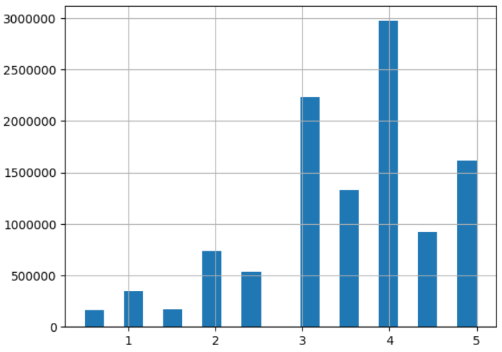

# Noelia's ML_OPS Project!  👻👻

---
## In this project, we put ourselves in the shoes of a data scientist who needs to take charge of a movie recommendation system for streaming platforms like Netflix, Amazon Prime, Disney Plus, and Hulu. The problem is that the data is unprocessed, there are no automated processes, and so on. Our task is to quickly perform data engineering work and have an MVP (minimum viable product) ready in about a week.


<br>
<br>
<br>

# This readme is divided into three parts:
## ✅ Exploratory data analysis (EDA), data cleaning, and data preparation
## ✅ Development of an API REST using FASTAPI (and its deployment)
## ✅ Movie Recommendation system implementation using the scikit-surprise library

<br>
<br>
<br>


# **Part 1: Initial Exploratory Data Analysis (EDA)** 
## **Data Cleaning / Data Transformation**


<br>

### <ins>**Libraries used**</ins>

All data analysis was performed in Python, using the following libraries:
    * Pandas
    * Numpy
    * Scikit-Learn
    * Matplotlib
    * Seaborn


### <ins>**Brief data description and transformations performed on it.**</ins>


There are 4 datasets on movies and series on different streaming platforms:
- Amazon:  `./data/amazon_prime_titles.csv`
- Disney plus: `./data/disney_plus_titles.csv`
- Hulu: `./data/hulu_titles.csv`
- Netflix: `./data/netflix_title.csv`

### <ins>**Columns description**</ins>

* show_id: String s+number e.g: s125
* type: Movie/Tv Show
* title: Movie name
* director: director
* cast: cast
* country: country
* date_added: date added to platform
* release_year: release year
* rating: +13/+18/etc
* duration: duration (180 min or 3 seasons)
* listed_in: movie category (romance/drama/horror/...)
* description: movie description

---

## <ins>🔧 **Basic transformations performed**</ins>

### 🔹**Notebook: clean_platform.ipynb**<br>

1. A new `id` column was added, formed by the first letter of the platform and the `show_id`
2. Null values from `rating` column were replaced to "G" --> Mature audience
3. Dates were parsed from (Month_name day, year ) to (yyyy/mm/dd)
4. All text field were transformed to lowercase
5. In the Hulu dataset, values from the `duration` column had been mistakenly included in the `rating` column. This problem was fixed.
6. The NaNs in the `duration` column have been replaced by "0 min"
7. The `duration` column was split into two different columns (`duration_int` and `duration_type`)
8. With all these transformations, there are still several columns with missing data.<br>
> Probably many of the missing data from the `director`, `cast` and `country` columns of a dataset (for example Netflix) could be found in another dataset (e.g Amazon). **I leave it as a future task**
9. For now, all missing data will be replace with "unknown "+cast/country/...
10. A large dataframe was created, and the columns 'date_added' and 'duration' were dropped.
10. Save large dataframe to `/data/clean/all_together_clean.csv`

Note: *When work locally, I have saved each individual cleaned dataframe to a separate CSV file. But it were included in the .gitignore file*

---

### 🔹**Notebook: clean_rating.ipynb**<br>
> We need to concatenate the user reviews information, which is available in 8 .csv files
1. No missing data
2. We upload the 8 files and save the data in a big dataframe
3. We dropped `timestamp`  column
4. Column `rating` were renamed to  `score` to match up with nomenclature used in the platforms datasets
5. Save to `/data/clean/all_ratings.csv` (add to gitignore file because is too large)

---

### 🔹**Notebook: load_score_to_platform_data.ipynb**
We only merge users reviews with movie information, and save to `/data/clean/all_together_with_score`

---
<br>
<br>


<br>
<br>

# Part 2: API REST
### Created using fastapi.

## 🟩 The API has been deployed in Render. 

### ➡️ Documentation: [Api documentation](https://noeliamovieapideploy.onrender.com/docs)

### ➡️ Public repository to deploy the API in render: [Api Github repo](https://github.com/PhDNoe/Movie_API_PI_MLOPS)

---

## 🟪 Available routes:

<br>

---

🟢 **GET /api**
> The API will return some info about other routes <br>
**Full path:** https://noeliamovieapideploy.onrender.com/api
```json
{
    "routes": {
        "/api/max_duration": "Movie with longer duration with optional filters of year, platform and duration_type",
        "/api/score_count": "Number of films by platform with a score greater than XX in a given year",
        "/api/count_platform": "Number of movies per platform. The platform must be specified.",
        "/api/actor": "Actor who appears the most times according to platform and year. "
    }
}

```

---

🟢 **GET /api/max_duration**
> If called without query parameters, the API will return the movie with the longest duration across all platforms, years, and duration types (seasons or minutes)<br>
**Full path:** https://noeliamovieapideploy.onrender.com/api/max_duration

```json
{
    "movie": "soothing surf at del norte for sleep black screen"
}

```

🟢 **GET /api/max_duration?year=2019**
> The API will return the movie with the longest duration across all platforms and duration types (seasons or minutes) for the 2019 year <br>
**Full path:** https://noeliamovieapideploy.onrender.com/api/max_duration?year=2019
```json
{
    "movie": "box fan medium  8 hours for sleep"
}

```


🟢 **GET /api/max_duration?platform=netflix**
> The API will return the movie with the longest duration on Netflix across all years and duration types.<br>
**Full path:** https://noeliamovieapideploy.onrender.com/api/max_duration?platform=netflix
```json
{
    "movie": "box fan medium  8 hours for sleep"
}

```

🟢 **GET /api/max_duration?year=2020&platform=Netflix&duration_type=seasons**
> The API will return the Netflix movie with the longest duration measured in seasons for the year 2019 <br>
**Full path:** https://noeliamovieapideploy.onrender.com/api/max_duration?year=2020&platform=Netflix&duration_type=seasons
```json
{
    "movie": "grey's anatomy"
}
```

🟡 **If any of the above queries do not match any results, the API will return:**
```json
{
    "message": "No results"
}
```

---

🟢 **GET /api/score_count?platform=Netflix&scored=3.6&year=2020**
> The API will return the number of films by platform=Netflix  with a score greater than XX=3.6 in a given year (2020)<br>
**Full path:** https://noeliamovieapideploy.onrender.com/api/score_count?platform=Netflix&scored=3.6&year=2020
```json
{
    "number_of_films": 71
}
```

---

🟢 **GET api/count_platform?platform=amazon**
> The API will return Number of movies per platform (Amazon)<br>
**Full path:** https://noeliamovieapideploy.onrender.com/api/count_platform?platform=amazon
```json
{
    "number_of_films": 9668
}
```

🟡 **If the platform is not Netflix, Amazon, Hulu or Disney (or any variations of their names in lowercase), the API will return**

```json
{
    "detail": [
        {
            "loc": [
                "query",
                "platform"
            ],
            "msg": "value is not a valid enumeration member; permitted: 'disney', 'netflix', 'amazon', 'hulu', 'Disney', 'Netflix', 'Amazon', 'Hulu'",
            "type": "type_error.enum",
            "ctx": {
                "enum_values": [
                    "disney",
                    "netflix",
                    "amazon",
                    "hulu",
                    "Disney",
                    "Netflix",
                    "Amazon",
                    "Hulu"
                ]
            }
        }
    ]
}
```

---
🟢 **GET /api/actor?platform=Netflix&year=2019**
> The API will return the actor who appears the most times according to platform and year specified.<br>
**Full path:** https://noeliamovieapideploy.onrender.com/api/actor?platform=Netflix&year=2019
```json
{
    "actor": "vincent tong"
}
```

🟡 **If the query do not match any results, the API will return:**
```json
{
    "message": "No results"
}
```
<br>
<br>
<br>


<br>
<br>

# Part 3: Movie Recommendation System
## Created using scikit-surprise library


<br>

> In this project a movie recommendation system was developed using the collaborative filtering technique through Singular Value Decomposition

#### **Remember:**
*A recommendation system implemented with collaborative filtering is a type of system that uses data from multiple users to recommend items to a particular user. It works by analyzing user behavior and preferences, and identifying patterns in the behavior of similar users. Based on these patterns, the system can predict which items a user might be interested in and recommend them to the user. Collaborative filtering can be implemented using different techniques, such as user-based or item-based filtering, and can be used in various applications, such as e-commerce, social media, and entertainment platforms*

---

### We are facing several problems with the dataset used for our recommendation system:

* The dataset is severely imbalanced, with many more reviews with 3, 4, and 5 ratings than reviews with 1 and 2 ratings. This will cause the recommendation system (if no balancing technique is used) to have a bias towards higher ratings and tend to recommend all movies.





* Another issue is that there are many users who have made very few reviews. The type of recommendation system we are implementing requires users to express their preferences to recommend future items based on their similarity in tastes with other users.
* There are several outliers among users, with one user having more than 18,000 recommendations.

---
<br>

### We tried different strategies to achieve a robust recommendation system that can address the issues mentioned above.

#### Finally, we decided to:

* Train a model only with users who have made at least Q1=15 recommendations (where Q1 is the first quartile of the data). This way, we removed users with very few reviews.
* We also removed the upper outliers, i.e., those users with a number of reviews greater than (Q3 + 1.5 IQR) = 207 reviews, where Q3 is the third quartile and IQR is the interquartile range.
* We created 10 artificial datasets using oversampling for the underrepresented classes and subsampling for the majority classes. This way, we ensured balanced classes.
* Each dataset was split into a training set and a test set (15% for the test set).
* We trained an ensemble of 10 SVD models, each using a different subset of data. The final recommendation decision was based on voting (more than half, plus one)


```python
def make_ensemble_predictions(userId, movieId):
    """
        Ensemble of 10 SVD models
    """
    preds = []
    for i in range(10):
        p1 = models[i].predict(userId, movieId).est
        preds.append(p1)
    
   
    preds = np.array(preds)
    votes = preds>2.5
    nvotes = np.count_nonzero(votes)
    if nvotes>4:
        return "Recomended Movie"
    else:
        return "not recommended Movie"
```

---
### RMSE across all test datasets

#### We conducted predictions across all the test sets, and the results were not as expected

```python
from surprise import accuracy
# predictions across all models
all_preds = []
for idx, model in enumerate(models):
    all_preds.append(model.test(train_test_sets[i][1]))

all_rmse = []
for p in all_preds:
    all_rmse.append(accuracy.rmse(p))


```

#### The RMSE values obtained on the test sets for each of the models were:

```python
RMSE: 1.2439
RMSE: 1.2438
RMSE: 1.2439
RMSE: 1.2439
RMSE: 1.2438
RMSE: 1.2439
RMSE: 1.2438
RMSE: 1.2440
RMSE: 1.2438
RMSE: 1.2439

```

> These results mean that the error in recommending a movie that a user would rate as 3.5 (recommended movie) could be scored on the lower end as 2.2 (not recommended movie).

> Another similar example, a movie rated 2.3, could be scored as 3.5 and recommended to a user who clearly has no preference for this movie.

---